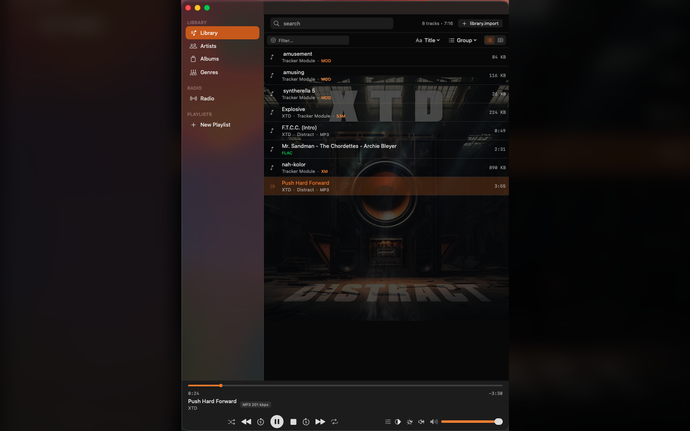
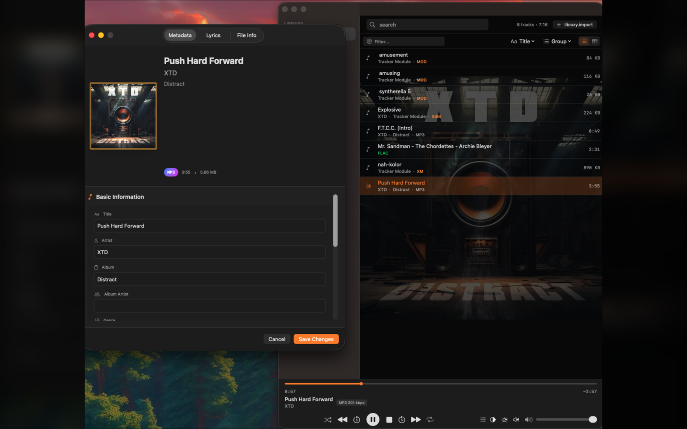
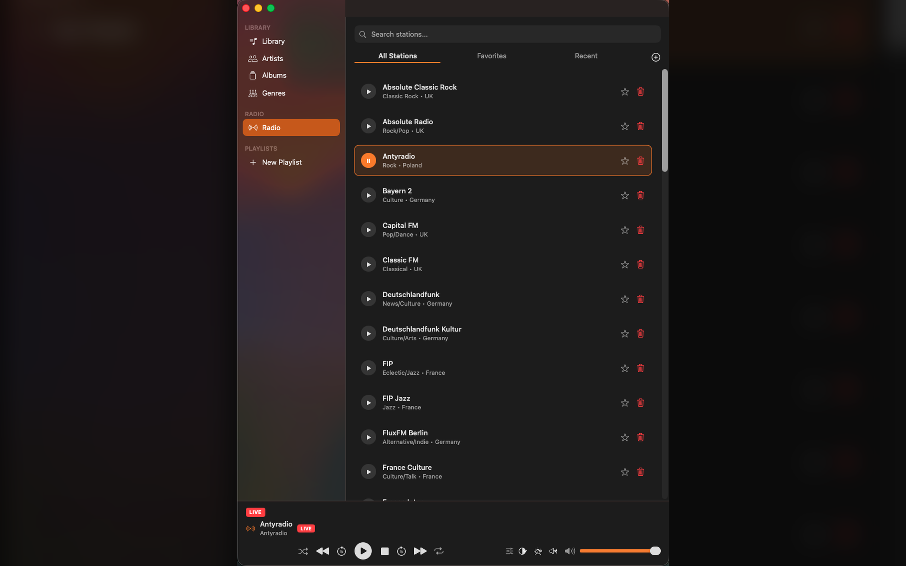
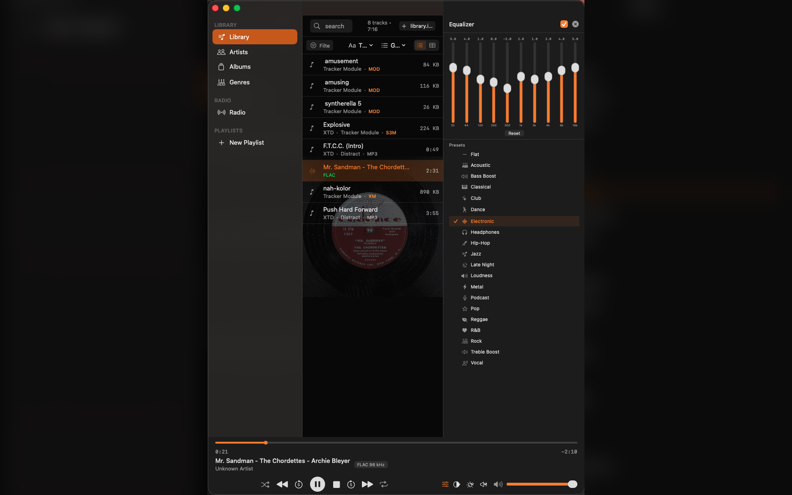
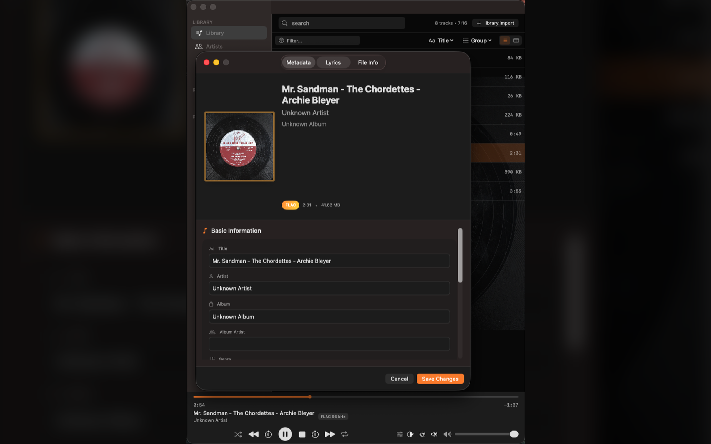
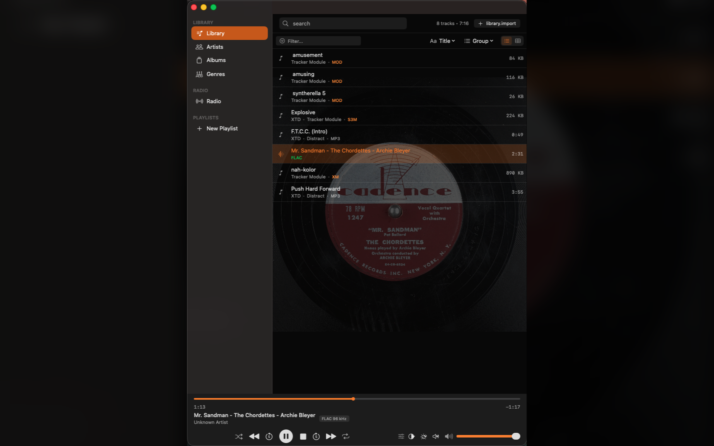
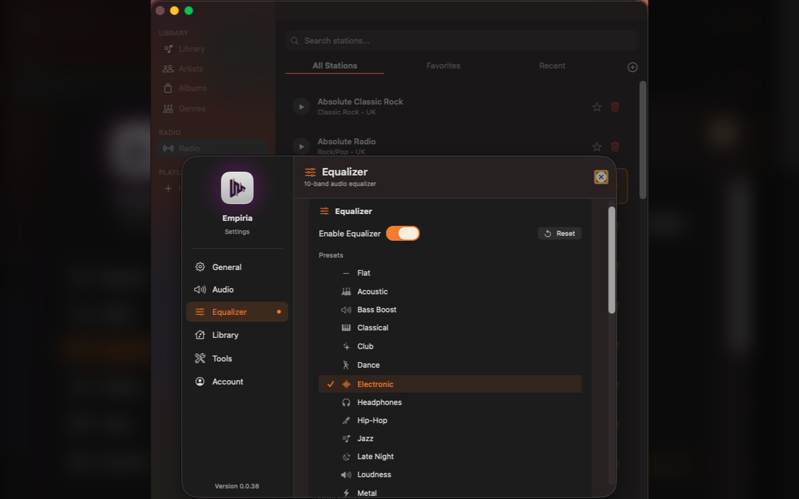
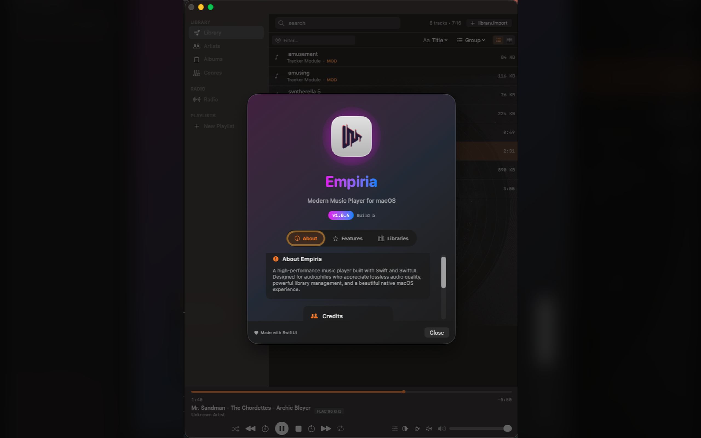

  

<h1 align="center">Empiria</h1>

  <strong>Modern Music Player for macOS</strong>

  
  

  
  
  
  

---

A high-performance music player built with Swift and SwiftUI. Designed for audiophiles who appreciate both modern formats and classic tracker modules. Featuring powerful library management, 10-band equalizer, and a beautiful native macOS experience.

---

## Features

### Tracker Module Support
Play MOD, S3M, XM, and IT tracker modules with authentic sound reproduction. Relive the golden age of demoscene music with full support for classic tracker formats.

### Hi-Fi Audio Formats
Support for FLAC, MP3, AAC, OGG Opus, WAV, AIFF, and M4A. Experience your music collection in the highest quality with native Core Audio integration.

### Smart Library Management
Organize your collection by artists, albums, and genres. Fast search, intuitive navigation, and automatic metadata detection keep your library perfectly organized.

### 10-Band Equalizer
Fine-tune your sound with a built-in 10-band equalizer and preset library including Flat, Acoustic, Bass Boost, Classical, Club, Dance, Electronic, Headphones, Hip-Hop, Jazz, Late Night, Loudness, Metal, Podcast, Pop, Reggae, R&B, Rock, Treble Boost, and Vocal presets.

### Internet Radio
Stream online radio stations directly within the app. Add your favorite stations and discover new music from around the world.

### Tag Editor
Edit metadata and album artwork for your tracks. Keep your music library perfectly organized with built-in tag editing capabilities.

### Media Key Support
Control playback with keyboard media keys. Full Now Playing integration with macOS Control Center and notification widgets.

### Native Dark Mode
Beautiful dark interface that follows your system preferences. Crafted with SwiftUI for a truly native macOS experience.

---

## Screenshots

<table>
  <tr>
    <td></td>
    <td></td>
  </tr>
  <tr>
    <td></td>
    <td></td>
  </tr>
  <tr>
    <td></td>
    <td></td>
  </tr>
  <tr>
    <td></td>
    <td></td>
  </tr>
</table>

---

## Supported Formats

| Category | Formats |
|----------|---------|
| **Audio** | FLAC, MP3, AAC, OGG Opus, WAV, AIFF, M4A |
| **Tracker Modules** | MOD, S3M, XM, IT |
| **Streaming** | HTTP/HTTPS Internet Radio |

---

## Requirements

- macOS 13.0 Ventura or later
- Apple Silicon or Intel processor
- 50 MB disk space

---

## Legal

- [Privacy Policy](https://7michalkozlik7.github.io/Empiria/privacy.html)
- [Terms of Service](https://7michalkozlik7.github.io/Empiria/terms.html)
- [EULA](https://7michalkozlik7.github.io/Empiria/eula.html)

---

  <strong>Your music. Your way.</strong>

  &copy; 2025 Michał Koźlik. All rights reserved.

